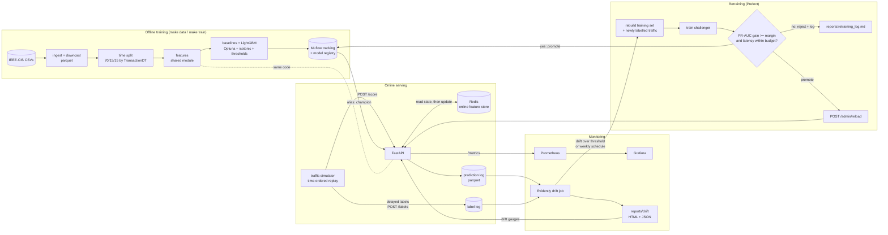

# Real-time transaction fraud scoring with monitoring and automated retraining

Fraud scoring on the IEEE-CIS Fraud Detection data: leakage-free features, a LightGBM model with cost-based decisions, a FastAPI service with a Redis online feature store, Prometheus/Grafana monitoring, Evidently drift detection, and a Prefect champion/challenger retraining loop. The full stack runs on one laptop with `docker compose`. Every number below comes from a run in this repo.

## Problem

Each transaction must be approved, sent to manual review, or blocked within tens of milliseconds. Fraud is 3.5% of transactions, so accuracy is meaningless (approving everything is 96.5% "accurate"). Costs (configurable in `configs/config.yaml`):

| Outcome | Cost |
|---|---|
| Fraud approved | the transaction amount (chargeback) |
| Manual review | $5 per transaction; review stops the fraud |
| Legitimate customer blocked | $25 |

The model outputs a calibrated probability. Review and block thresholds are chosen on validation to minimise total cost, then applied unchanged to test.

## Architecture



## Results

Test set: 88,581 transactions (2018-05-01 to 2018-05-31), 3,083 fraud. Thresholds and calibration are fit on validation. Plots, SHAP and confusion matrices: [`reports/results.md`](reports/results.md), [`reports/metrics.json`](reports/metrics.json).

| Model | PR-AUC | ROC-AUC | Recall @1% FPR | Precision @80% recall | Expected cost | Saved vs no model | Saved vs rules |
|---|---:|---:|---:|---:|---:|---:|---:|
| No model (approve all) | – | – | – | – | $469,609 | – | – |
| Rules engine | 0.041 | 0.547 | 0.009 | 0.035 | $271,289 | $198,320 (42.2%) | – |
| Logistic regression | 0.276 | 0.846 | 0.256 | 0.095 | $211,483 | $258,125 (55.0%) | $59,806 |
| LightGBM, no reweighting | 0.543 | 0.899 | 0.474 | 0.140 | $176,377 | $293,232 (62.4%) | $94,912 |
| LightGBM, `scale_pos_weight` | 0.541 | 0.896 | 0.469 | 0.140 | $174,600 | $295,008 (62.8%) | $96,689 |
| LightGBM, sqrt(`scale_pos_weight`) | 0.545 | 0.899 | 0.470 | 0.139 | $169,429 | $300,179 (63.9%) | $101,860 |
| **LightGBM + isotonic (served)** | **0.543** | **0.899** | **0.474** | **0.140** | **$176,377** | **$293,232 (62.4%)** | **$94,912** |

- The served model cuts cost 62% versus approving everything. It flags 78% of fraud (2,405 of 3,083) and sends 15.6% of traffic to review. At the block threshold, 957 frauds are blocked against 202 good customers.
- Class weighting doesn't help ranking. Valid PR-AUC: 0.639 unweighted, 0.635 with `scale_pos_weight`, 0.636 with its square root. The unweighted model was kept. The square-root variant is cheapest on test (−$7k), but selection was made on valid.
- Optuna (30 trials, TPE) never beat the seeded defaults (best valid PR-AUC 0.6452, trial 0), so the "tuned" model is the default model.
- The model used all 3,000 rounds (best iteration 2,997), so more rounds might help slightly.
- Isotonic calibration improves the Brier score from 0.0225 to 0.0222 without changing ranking.

**Training/serving skew.** I replayed 44,292 live transactions through the API (velocity features from Redis) and compared logged features with offline ones (`scripts/check_skew.py`, [`reports/skew_check.json`](reports/skew_check.json)). 171 of 10,054,284 feature values differ (0.0017%), all in `uid_amt_std_prev` and `uid_amt_zscore` (floating-point noise near zero variance). Decisions match on 44,290 of 44,292 (99.995%); max score difference 0.012.

**Latency.** `scripts/benchmark_latency.py`, 2,000 live transactions, dockerised API, 1 uvicorn worker, 4 cores ([`reports/latency.json`](reports/latency.json)):

| Clients | Throughput | Client p50 | Client p95 | Client p99 | Server p95 |
|---:|---:|---:|---:|---:|---:|
| 1 | 37.8 req/s | 24.6 ms | 35.7 ms | 41.6 ms | 29.1 ms |
| 4 | 39.9 req/s | 97.6 ms | 125.2 ms | 141.8 ms | 31.0 ms |
| 8 | 39.6 req/s | 198.2 ms | 240.7 ms | 271.5 ms | 31.3 ms |

The p95 < 50 ms target holds for a single stream. Scoring is single-threaded FIFO so state updates stay ordered, which caps throughput near 40 req/s; beyond that requests queue. Scaling out needs card-sharded routing. The model alone costs 3.3 ms p50 / 4.2 ms p95 including reason codes; the rest is Pydantic validation, pandas feature assembly and two Redis round trips.

## Drift demo

The same 44,292 live transactions (2018-05-15 to 2018-05-31) were replayed three times, with labels revealed 48 simulated hours after each transaction.

| | 1. Normal (v1) | 2. `--drift` (v1) | 3. `--drift` after promotion (v2) |
|---|---:|---:|---:|
| Features drifted (Evidently, Wasserstein ≥ 0.1) | 19% (5/26) | 35% (9/26) | 12% (3/26) |
| Prediction drift (normed Wasserstein) | 0.057 | 0.147 | 0.021 |
| Drift detected (≥30% of features or prediction drift ≥ 0.10) | no | yes → retraining | no |
| Reviews / blocks | 7,179 / 629 | 10,710 / 675 | 4,006 / 994 |
| Live PR-AUC, last 10k labelled rows | 0.553 | 0.497 | 0.666 * |

\* Out-of-sample: those rows fall inside v2's fresh holdout. Replay 3's earlier rows were in v2's training pool, so its decision counts aren't a clean comparison.

Sequence:
1. Replay 1: five features drift naturally (reference is April, traffic is late May), under the 30% threshold.
2. Replay 2: the scheduled Prefect `drift-monitor` (every 5 min) flagged 9 features and prediction drift. Once enough labels arrived, it triggered `retrain-champion-challenger` itself. Reviews rose 49% on the same transactions.
3. Challenger v2 was scored on a fresh holdout (the latest 11,639 labelled transactions, 449 frauds, never trained on) and promoted automatically:

   | Holdout (2018-05-25 to 2018-05-29) | Champion v1 | Challenger v2 |
   |---|---:|---:|
   | PR-AUC | 0.488 | 0.670 |
   | ROC-AUC | 0.883 | 0.947 |
   | Recall @1% FPR | 0.412 | 0.599 |
   | Precision @80% recall | 0.123 | 0.295 |
   | Expected cost | $53,722 | $42,177 |
   | p95 model latency | – | 3.7 ms (budget 50 ms) |

   Gate: `PROMOTED: PR-AUC gain +0.1819 >= +0.0050, latency p95 3.7ms within budget`. Aliases: `champion → v2`, `previous-champion → v1`; the API hot-reloaded v1 → v2. See [`reports/retraining_log.md`](reports/retraining_log.md).
4. Replay 3: against v2's holdout as reference, drift falls to 12% (prediction drift 0.021) and no alarm fires.

**What the +0.18 PR-AUC gain reflects.** Mostly fresher labels, not adaptation to the injected drift. The drift cost v1 about 0.056 live PR-AUC (0.553 → 0.497), while v2 also trained on two extra months of labels, and fraud in this dataset repeats on the same cards and pseudo-users. What the demo does show is that the loop detects drift, waits for labels, and promotes only a challenger that is better on unseen future data.

**Bugs found and fixed.** (1) Each 5-minute monitor run launched another retrain while one was running; fixed with a lock file and a Prefect concurrency limit of 1. (2) After promotion the monitor compared v1 predictions with a v2 reference and kept reporting 35% drift; fixed by comparing only predictions from the reference's model version and using the challenger's holdout as the new reference.

Evidently reports and JSON summaries are in [`reports/drift_examples/`](reports/drift_examples). The Grafana screenshot is `docs/img/grafana_overview.png`. Evidently's own header uses its default 50% rule; the pipeline uses 30% or prediction drift ≥ 0.10 (`fraud.monitor.drift`).

Run it:

```bash
make up                # api, redis, mlflow, prometheus, grafana, prefect server + worker
make warm              # load pre-live history into Redis (~85 s)
make simulate-drift SIMARGS="--batch-size 20"   # ~15 min for 44k transactions
# drift-monitor (every 5 min) detects drift once labels arrive, retrains, gates, hot-reloads.
# Or by hand:  make monitor MONITORARGS=--auto-retrain
```

| UI | URL |
|---|---|
| API docs | http://localhost:8000/docs |
| Grafana (anonymous viewer) | http://localhost:3000 |
| MLflow | http://localhost:5000 |
| Prefect | http://localhost:4200 |

## Quickstart

```bash
make venv                  # Python 3.11 virtualenv from requirements/dev.txt
make data                  # Kaggle download (needs ~/.kaggle/kaggle.json + accepted rules), ingest, split
make data SAMPLE=--sample  # optional: ~20% of cards
make up                    # MLflow must be up before training registers models
make train                 # feature selection, features, baselines, LightGBM, reports, registration
make test                  # 38 tests on synthetic fixtures, no Kaggle needed
make bench                 # latency benchmark
```

Targets: `data train evaluate serve warm simulate simulate-drift monitor retrain test lint bench up down all demo`.

Data provenance: this run used a byte-identical re-upload of the competition files (Kaggle `lnasiri007/ieeecis-fraud-detection`) because the competition rules hadn't been accepted on the account used. Checked: file sizes match the official listing, 590,540 rows, 3.50% fraud, TransactionDT 86,400–15,811,131, 144,233 identity rows. `make data` uses the official download.

## Design

**Leakage controls**
- Time split by `TransactionDT`: 70% train, 15% valid, 15% test, with cut points moved so no timestamp straddles two splits. The last half of test (2018-05-15 to 2018-05-31) is the live stream.
- Encoders fit on train only. Target encoding is out-of-fold (5 folds) on train and uses the full-train mapping elsewhere. V-column selection uses train.
- Aggregates are past-only, ordered by (`TransactionDT`, `TransactionID`). Tests check against a brute-force recomputation, that deleting later rows doesn't change earlier features, and that the current row is excluded.
- Valid drives early stopping, weighting choice, Optuna, calibration and thresholds. Test is touched once.

**Features** (`configs/features.yaml`, `v1`, 227 model features)
- Pseudo-user `uid = card1 + addr1 + (day − D1)`, an approximation (people can collide or split). In the EDA, 93% of uids with 5+ transactions are all-fraud or all-legit, which is why per-uid history helps and why future rows would leak.
- Past-only velocity: count and sum per card1 and uid over 1 h / 24 h / 7 d, time since previous transaction, per-uid expanding amount mean/std/ratio/z-score, distinct devices and emails, new-device and new-email flags.
- Time and amount features; frequency encoding (12 columns); smoothed out-of-fold target encoding (8 columns).
- V-columns: 339 → 107. Drop those with >85% nulls on train (none on full train; 47 on the sample), then greedily keep a column only if |Pearson r| < 0.75 with all kept columns.
- One module, two paths: `fraud/features/definitions.py` holds windows, keys and `derive()`. The offline builder (`history.py`, `searchsorted` over prefix sums, about 11 s for 590k rows) and the Redis store (`online.py`) produce raw aggregates only, and both feed the same `derive()` and `FeaturePipeline`. `tests/test_features.py::test_offline_online_parity` streams rows through fakeredis and compares.

**Modelling choices**
- Time split over random: labels are correlated within uid, so a random split would leak and inflate metrics. The valid-to-test PR-AUC drop (0.64 → 0.54) shows decay over one month.
- PR-AUC and recall at 1% FPR over accuracy and ROC-AUC (0.90 despite poor precision at 3.5% fraud). Dollar cost is the final measure.
- Thresholds come from an exhaustive vectorised search over (review, block) pairs, tested against brute force.
- Plain isotonic regression is flat over long stretches and cut sample-run PR-AUC from 0.526 to 0.501. Adding `1e-6 × raw` keeps the mapping strictly increasing, so ranking equals the raw model's.
- Redis keeps per-card and per-uid sorted sets (7 days) and hashes (count, sum, sum of squares, last seen). Scoring reads state, scores, then updates, so updates must be ordered, hence the single FIFO scoring thread.

**Serving**
- `POST /score` returns `{fraud_probability, decision, reason_codes, model_version, latency_ms}`. Also `POST /score/batch` (time-ordered), `POST /labels`, `GET /health`, `/metadata`, `/metrics`, and `POST /admin/reload` (needs `X-API-Key`, constant-time compared with `ADMIN_API_KEY`).
- A Pydantic schema generated from the feature config validates input; bad fields return a 422 listing each one.
- The API loads the `champion` alias at startup and hot-swaps on reload; in-flight requests finish on the old model.
- Reason codes are the top 3 features pushing the score up, from exact decision-path attribution (Saabas), which sums to the raw log-odds (tested). On the 1,472-tree sample model, TreeSHAP took 47 ms p50 versus 2.1 ms. On the served 2,997-tree model, predict + calibration + reason codes take 3.3 ms p50.
- Each prediction (request, 227 features, score, decision, version, latency) goes to a buffered parquet log used by monitoring and retraining. Logs are structured JSON.

**Monitoring.** Prometheus metrics cover requests, latency and score histograms, decisions, errors, model version/reloads, and drift and live-performance gauges. Grafana is provisioned from `infra/grafana/`. The Evidently job (`fraud.monitor.drift`) compares the latest 5,000 predictions with a reference of out-of-sample validation rows, over the top-20 features by gain plus amount, device, email and hour features and the score. Live PR-AUC, recall and precision use the latest 10,000 labelled predictions. Output: `reports/drift/drift_report_*.html` and `summary_*.json`.

**Retraining** (`fraud/pipelines`)
- Trigger: `drift-monitor` runs every 5 min and starts `retrain-champion-challenger` when drift is over threshold, at least 5,000 labels have arrived, the 60-minute cooldown has passed and no retrain is running. A weekly cron retrains regardless.
- Training set: all labelled history plus logged live traffic with labels, with features recomputed over the full timeline.
- Holdout: the most recent 30% of newly labelled rows. The challenger never trains at or after the holdout start (tested).
- Challenger: champion hyperparameters, two stages, recent live rows weighted ×3. In the demo: 573,405 training rows (27,157 newly labelled), stage A stopped at 1,562 rounds. Stage A early-stops, calibrates and sets thresholds on the latest 15% of the pool; stage B refits on the full pool.
- Gate: holdout PR-AUC at least 0.005 above champion and p95 model latency within 50 ms. On promotion the `champion` alias moves (old one becomes `previous-champion`), the drift reference is replaced and `/admin/reload` is called. A margin avoids churn from noise.
- Every run, promoted or rejected, is logged to MLflow `fraud-retraining` and [`reports/retraining_log.md`](reports/retraining_log.md).

**MLflow.** SQLite backend with served artifacts. Each run logs params, metrics, plots, feature list, split dates, row counts and git commit. Models register as `fraud-detector`; the first version is `champion`, later ones `challenger`.

**Images.** The serving image is 702 MB: no scikit-learn, Optuna, SHAP, Prefect or full MLflow (`mlflow-skinny`, stripped shared libraries, no pip). Most of the remainder is pyarrow and scipy (a LightGBM dependency). The pipelines image is 1.8 GB and also runs the MLflow server, so client and server versions match.

## Limitations

- Label delay is a fixed 48 h here; real chargebacks take 30–120 days. Proxy signals (review outcomes, early disputes) would help.
- The pseudo-user is approximate. A shared card/device/email/address graph (connected components or GNN) would capture fraud rings better.
- The simulator calls the API directly. Production would use Kafka for transactions and labels.
- One process handles about 40 req/s. Horizontal scaling needs card-sharded routing or an atomic Redis Lua script for read-and-update.
- Promotion is all-or-nothing. Shadow deployment or A/B on a traffic slice would de-risk it; `previous-champion` already allows rollback.
- Simulated drift is covariate shift only. A new fraud pattern (concept drift) would be a harder test.
- Not done: XGBoost/CatBoost baselines, and model-size reduction (3,000 trees) for lower latency.

## Layout

```
src/fraud/
  data/        ingest (join, downcast, parquet, --sample), time split
  features/    definitions (shared), history (offline), online (Redis), encoders, pipeline, V selection
  train/       baselines, LightGBM + Optuna, registry (MLflow), train entry point
  evaluate/    metrics, cost model + threshold search, report, plots
  serve/       FastAPI app, schemas, scoring service, prediction log, Prometheus metrics, store warm-up
  monitor/     Evidently drift + live performance
  pipelines/   retraining logic, Prefect flows, Prefect serve entry point
  model.py     deployable bundle (pipeline + booster + calibrator + thresholds)
  explain.py   fast reason codes (decision-path attribution)
configs/       config.yaml (paths, split, costs, training, monitoring, retraining), features.yaml
scripts/       simulate.py, benchmark_latency.py, check_skew.py
tests/         38 tests on synthetic IEEE-shaped fixtures
notebooks/     01_eda.ipynb
infra/         prometheus/, grafana/ (provisioning + dashboard)
reports/       metrics.json, results.md, plots, drift/, retraining_log.md, latency/skew checks
```

Typed Python 3.11, ruff and black, pinned lock files (`requirements/*.txt`, compiled with `uv`), a multi-stage non-root Dockerfile, and a GitHub Actions workflow (lint, fixture tests, image builds; never downloads Kaggle data).
