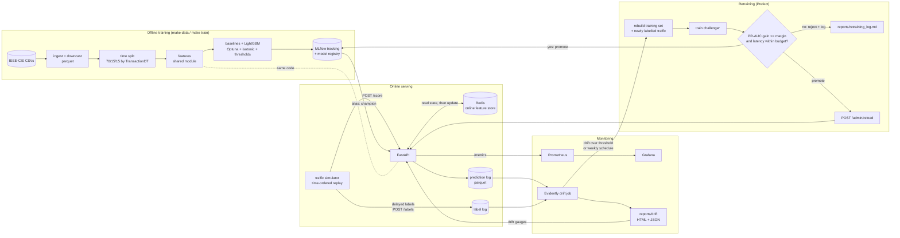
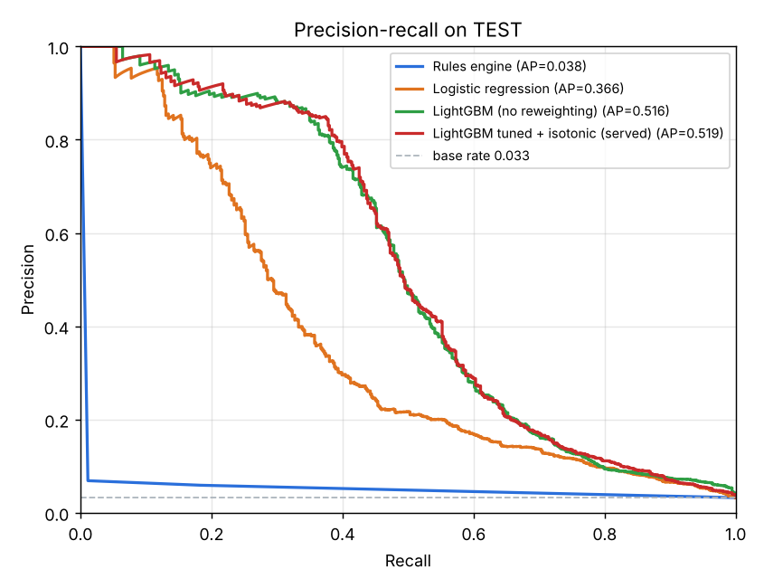
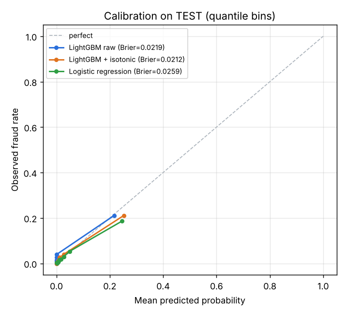
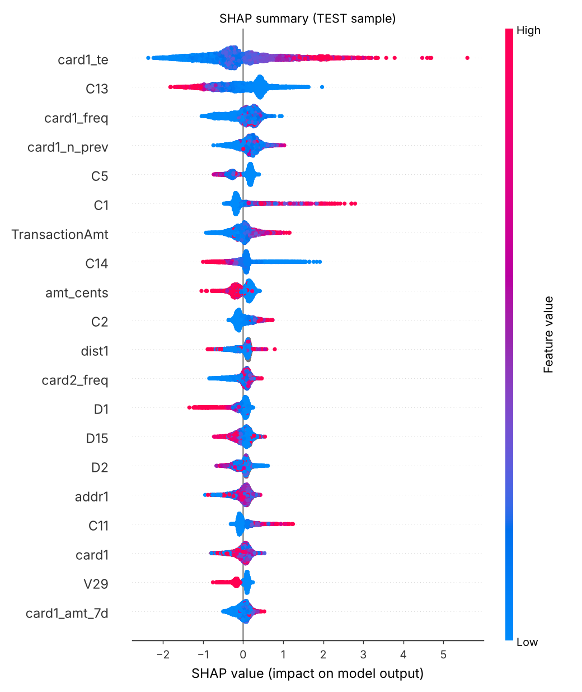
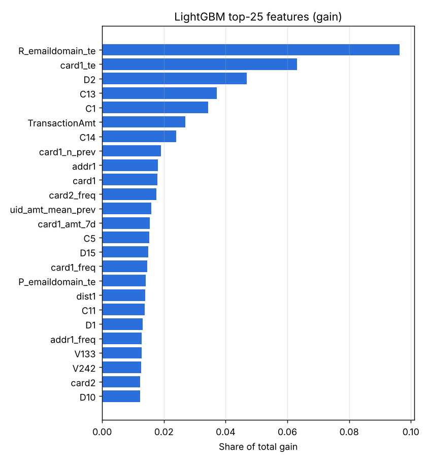
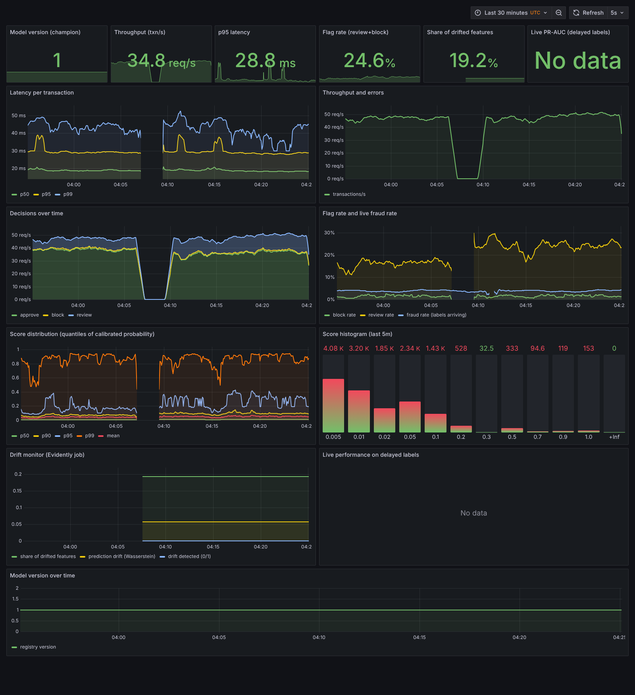

# Real-time transaction fraud scoring with monitoring and automated retraining

A production-style fraud system on the IEEE-CIS Fraud Detection data. It covers leakage-free features, a LightGBM model with cost-based decisions, a FastAPI scoring service with a Redis online feature store, Prometheus/Grafana monitoring, Evidently drift detection, and a Prefect champion/challenger retraining loop. The whole stack runs on one laptop with `docker compose`.

**Every number in this README comes from a run in this repository.** Where a result came out worse than expected, it is reported as is.

## Problem and business framing

A payment processor must decide in tens of milliseconds whether to **approve**, send to **manual review**, or **block** each transaction. Fraud is rare: 3.5% of transactions here. Accuracy is therefore meaningless, since approving everything is 96.5% "accurate" and stops no fraud. The two kinds of mistake also cost different amounts:

| Outcome | Cost used here (configurable in `configs/config.yaml`) |
|---|---|
| Fraud approved (missed) | the transaction amount (chargeback) |
| Manual review | $5 per reviewed transaction (analyst time); review stops the fraud |
| Legitimate customer blocked | $25 (lost margin and churn) |

The model outputs a calibrated probability. Two thresholds (review and block) are chosen on the **validation** period to minimise this total cost, and then applied unchanged to the **test** period.

## Architecture



## Results

Full data: 590,540 transactions. Thresholds and calibration are chosen on VALID; every figure below is on TEST (88,581 transactions from 2018-05-01 to 2018-05-31, of which 3,083 are fraud). Source files: [`reports/results.md`](reports/results.md) and [`reports/metrics.json`](reports/metrics.json).

| Model | PR-AUC | ROC-AUC | Recall @1% FPR | Precision @80% recall | Expected cost | Saved vs no model | Saved vs rules |
|---|---:|---:|---:|---:|---:|---:|---:|
| No model (approve all) | – | – | – | – | $469,609 | – | – |
| Rules engine (high amount / new device / email mismatch) | 0.041 | 0.547 | 0.009 | 0.035 | $271,289 | $198,320 (42.2%) | – |
| Logistic regression | 0.276 | 0.846 | 0.256 | 0.095 | $211,483 | $258,125 (55.0%) | $59,806 |
| LightGBM, no reweighting | 0.543 | 0.899 | 0.474 | 0.140 | $176,377 | $293,232 (62.4%) | $94,912 |
| LightGBM, `scale_pos_weight` | 0.541 | 0.896 | 0.469 | 0.140 | $174,600 | $295,008 (62.8%) | $96,689 |
| LightGBM, sqrt(`scale_pos_weight`) | 0.545 | 0.899 | 0.470 | 0.139 | $169,429 | $300,179 (63.9%) | $101,860 |
| **LightGBM + isotonic (served model)** | **0.543** | **0.899** | **0.474** | **0.140** | **$176,377** | **$293,232 (62.4%)** | **$94,912** |

What these numbers mean:
- **Cost.** The served model cuts the cost of fraud by 62% compared with approving everything, and by $95k a month compared with the rules engine. It flags 78% of fraud (2,405 of 3,083) while sending 15.6% of traffic to review. At the block threshold, 957 frauds are blocked against 202 good customers. Confusion matrices are in [`reports/results.md`](reports/results.md).
- **Class weighting.** Weighting does not help ranking. Valid PR-AUC was 0.639 with no weights, 0.635 with `scale_pos_weight` and 0.636 with its square root, so the unweighted model was kept. On test, the square-root variant happens to have the lowest cost (−$7k). Model selection was made on valid, and I did not re-pick on test.
- **Tuning.** Optuna ran 30 trials (TPE). None beat the seeded default configuration on valid PR-AUC (best 0.6452, which was trial 0, the defaults), so the "tuned" model *is* the default model.
- **Rounds.** At the final learning rate, the model used the full 3,000 rounds before early stopping triggered (best iteration 2,997), so more rounds might help slightly.
- **Calibration.** Isotonic calibration improves the Brier score from 0.0225 to 0.0222 without changing ranking (see the tie-breaker under design decisions).

| PR curves (test) | Calibration (test) |
|---|---|
|  |  |

| Global SHAP (test sample) | Feature importance (gain) |
|---|---|
|  |  |

### Training/serving skew on real traffic

The whole live stream was replayed through the deployed API: 44,292 transactions, with velocity features computed from Redis. The features the API logged were then compared with the offline features for the same transactions (`scripts/check_skew.py`, [`reports/skew_check.json`](reports/skew_check.json)):

- **Feature values:** 171 of 10,054,284 differ (0.0017%), all in `uid_amt_std_prev` and `uid_amt_zscore`. This is floating-point noise in the sum-of-squares variance near zero.
- **Decisions:** identical for 44,290 of 44,292 transactions (99.995%). p99 absolute score difference is 0.0 and the maximum is 0.012.

### Latency

Measured with `scripts/benchmark_latency.py`: 2,000 real live transactions against the dockerised API (1 uvicorn worker, 4-core sandbox). Source: [`reports/latency_benchmark.json`](reports/latency_benchmark.json).

| Concurrent clients | Throughput | Client p50 | Client p95 | Client p99 | Server p95 (scoring only) |
|---:|---:|---:|---:|---:|---:|
| 1 | 37.8 req/s | 24.6 ms | **35.7 ms** | 41.6 ms | 29.1 ms |
| 4 | 39.9 req/s | 97.6 ms | 125.2 ms | 141.8 ms | 31.0 ms |
| 8 | 39.6 req/s | 198.2 ms | 240.7 ms | 271.5 ms | 31.3 ms |

The p95 < 50 ms target is met for a single stream. The process scores on one thread by design (FIFO, so feature-state updates stay ordered), so it saturates at about 40 req/s. Above that, requests queue: server-side scoring stays around 31 ms p95, but client latency grows with concurrency. Scaling out would mean more API replicas with **card-sharded routing**, so that one card's state is always updated by one replica. The model alone costs 3.3 ms p50 / 4.2 ms p95, including reason codes; the rest is Pydantic validation, pandas feature assembly and two Redis round trips.

## Drift demo (real run)

The same 44,292 live transactions were replayed twice, with labels revealed 48 simulated hours after each transaction:

| | Normal replay | `--drift` replay (amount ×2.5, 60% of devices replaced by new models) |
|---|---:|---:|
| Share of monitored features drifted (Evidently, Wasserstein ≥ 0.1) | 19% (5 of 26) | **35% (9 of 26)** |
| Prediction drift (Wasserstein, normed) | 0.057 | **0.147** |
| Drift detected (threshold: ≥30% of features or prediction drift ≥ 0.10) | no | **yes** |
| Mean fraud score (reference 0.034) | – | 0.051 |
| Reviews (same transactions) | 7,179 | 10,710 (+49%) |
| Live PR-AUC on the most recent 10k labelled rows | 0.553 | 0.497 |
| Live PR-AUC on all 38,796 labelled rows | 0.553 | 0.501 |

Notes:
- **Normal replay.** Even without injected drift, 5 features drift naturally (`TransactionAmt`, `log_amt`, `hour`, `card1_amt_7d`, `V188`), because the reference is April and live traffic is late May. This stays under the threshold.
- **Drifted replay.** The drift was caught by the **scheduled Prefect monitor** (every 5 minutes) on its own. It also flagged `DeviceInfo_freq`, `DeviceType_map`, `DeviceInfo_te` and `uid_device_is_new`, and triggered retraining automatically.

RETRAINING_RESULT_PLACEHOLDER



### Run the demo yourself

```bash
make up                # api, redis, mlflow, prometheus, grafana, prefect server + worker
make warm              # load the pre-live history into Redis (about 85 s)
make simulate-drift SIMARGS="--batch-size 20"   # about 15 min for 44k transactions
# the prefect-worker's drift-monitor deployment (every 5 min) detects the drift once labels arrive,
# retrains, applies the promotion gate and hot-reloads the API if the challenger wins.
# Or run it by hand:  make monitor MONITORARGS=--auto-retrain
```

| UI | URL |
|---|---|
| API docs | http://localhost:8000/docs |
| Grafana (anonymous viewer) | http://localhost:3000 |
| MLflow (runs, registry, aliases) | http://localhost:5000 |
| Prefect (flow runs, schedules) | http://localhost:4200 |
| Drift reports | `reports/drift/drift_report_*.html` |

## Quickstart

```bash
make venv                  # Python 3.11 virtualenv from the pinned requirements/dev.txt
make data                  # Kaggle download (needs ~/.kaggle/kaggle.json + accepted rules), ingest, split
make data SAMPLE=--sample  # optional: about 20% of cards for fast iteration
make up                    # start the stack (MLflow must be up before training registers models)
make train                 # V-column selection, features, baselines, LightGBM, reports, MLflow registration
make test                  # 38 tests on synthetic fixture data (no Kaggle needed)
make bench                 # latency benchmark
```

Main Makefile targets: `data train evaluate serve warm simulate simulate-drift monitor retrain test lint bench up down all demo`.

**Data provenance:** this run used a byte-identical re-upload of the competition files (Kaggle dataset `lnasiri007/ieeecis-fraud-detection`) because the competition rules had not been accepted on the account used. The checks performed: file sizes match the official listing, 590,540 rows, 3.50% fraud, TransactionDT range 86,400–15,811,131, and 144,233 identity rows. `make data` uses the official competition download.

## How it works

### Evaluation protocol (no leakage)
- **Time split, never random:** the first 70% of rows (by `TransactionDT`) are train, the next 15% valid and the last 15% test. Cut points move so that no timestamp straddles two splits. The last half of test (2018-05-15 to 2018-05-31) is the "live" stream used by the simulator.
- **Encoders fitted on train only.** Frequency maps come from train. Target encoding is out-of-fold (5 folds) for train rows and uses the full-train mapping for valid, test and serving. V-column selection is computed on train.
- **Past-only aggregates:** each row sees only the rows before it in (`TransactionDT`, `TransactionID`) order. Tests enforce this: a brute-force recomputation from earlier rows, a check that features of the first k rows don't change when later rows are deleted, and a check that the current transaction is excluded.
- **Valid is used for** early stopping, the weighting choice, Optuna, isotonic calibration and thresholds. **Test is touched once.**

### Features (`configs/features.yaml`, version `v1`, 227 model features)
- **Pseudo-user** `uid = card1 + addr1 + (day − D1)`, where D1 is days since the card was first seen, so `day − D1` is the card's start date. **This is an approximation:** different people can collide and one person can split across uids. The EDA shows 93% of uids with 5 or more transactions are all-fraud or all-legit, which is why per-uid history helps and why using future rows would leak.
- **Velocity (past only):** count and sum of amounts per card1 and per uid over 1 h, 24 h and 7 d; seconds since the previous transaction; per-uid expanding amount mean, std, ratio and z-score; distinct devices and emails per uid; and whether this device or email is new for the uid.
- **Time and amount:** hour, day of week, log amount, cents part, purchaser/recipient email match.
- **Categorical:** frequency encoding (12 columns) and smoothed out-of-fold target encoding (8 columns: card, email domains, device, product code).
- **V-columns** (339 originally): drop those with more than 85% nulls on train, then greedily keep a column only if |Pearson r| < 0.75 with every column already kept (ordered by null rate). 102 are kept. The method and counts are written into the YAML by `python -m fraud.features.select`.

**One module, two execution paths.** `fraud/features/definitions.py` defines the windows, the keys and `derive()`, which turns raw aggregates into features. The offline builder (`history.py`, vectorised with `searchsorted` on per-key prefix sums; all 590k rows take about 11 s) and the Redis store (`online.py`) only produce *raw aggregates*. Both feed the same `derive()` and the same fitted `FeaturePipeline`, and a parity test (`tests/test_features.py::test_offline_online_parity`) streams rows through fakeredis and compares the results.

### Serving
- `POST /score` returns `{fraud_probability, decision, reason_codes, model_version, latency_ms}`. Also available: `POST /score/batch` (processed in time order), `POST /labels` (delayed ground truth), `GET /health`, `GET /metadata`, `GET /metrics`, and `POST /admin/reload` (requires the `X-API-Key` header, compared in constant time with `ADMIN_API_KEY`).
- **Input contract:** a Pydantic schema generated from the feature config, with required core fields and range checks. Invalid input gets a 422 listing each bad field (for example `{"field": "TransactionAmt", "message": "Input should be greater than 0"}`).
- **Model loading:** the API loads the `champion` alias from the MLflow registry at startup, and hot-swaps it on reload. In-flight requests finish on the old model.
- **Reason codes:** the top 3 features pushing the score up, from an exact decision-path attribution (Saabas). The contributions sum to the model's raw log-odds output, which is verified in tests. Exact TreeSHAP took about 47 ms per request on 3,000 trees; this takes about 2 ms. Global explanations use exact TreeSHAP.
- **Logging:** structured JSON logs. Each prediction (raw request, all 227 features, score, decision, version, latency) goes to a buffered parquet prediction log that feeds monitoring and retraining.

### Monitoring
- **Prometheus metrics:** request and transaction counts, a latency histogram, a score histogram, decision counts, error counts, model version and reload counts, plus drift and live-performance gauges read from the latest monitor summary.
- **Grafana** is provisioned from files (`infra/grafana/`): datasource and dashboard JSON.
- **Evidently job** (`fraud.monitor.drift`) compares the latest 5,000 predictions with the reference. The reference is out-of-sample validation rows from the champion's training. The job checks the top-20 features by gain plus amount, device, email and hour features, and the score itself (prediction drift). Labels arrive late, so live PR-AUC, recall and precision are computed on the most recent 10,000 *labelled* predictions. Output goes to `reports/drift/drift_report_*.html` and `summary_*.json`.

### Retraining (`fraud/pipelines`)
- **Trigger:** the Prefect `drift-monitor` deployment runs every 5 minutes. When drift is over the threshold, at least 5,000 delayed labels have arrived, the 60-minute cooldown has passed and no other retrain is running, it runs `retrain-champion-challenger`. A weekly cron deployment retrains regardless of drift.
- **Training set:** all labelled history plus the logged live traffic whose labels have arrived. Features are recomputed over the full timeline, so live rows see the same history the API saw.
- **Fresh holdout:** the most recent 30% of the newly labelled rows. The challenger never trains on anything at or after the holdout start (tested).
- **Challenger:** trained with the champion's hyperparameters in two stages, with recent live rows weighted ×3. Stage A early-stops, calibrates and sets thresholds on the most recent 15% of the training pool. Stage B refits on the full pool.
- **Gate:** promote only if the challenger's holdout PR-AUC is at least 0.005 above the champion's *and* the challenger's p95 model latency is within the 50 ms budget. On promotion: the `champion` alias moves (the old champion becomes `previous-champion`), the drift reference is replaced, and `POST /admin/reload` is called.
- **Audit trail:** every run, promoted or rejected, is logged to the MLflow `fraud-retraining` experiment and to [`reports/retraining_log.md`](reports/retraining_log.md).

### MLflow
- **Tracking:** a SQLite backend with served artifacts, in docker-compose.
- **Each training run logs:** params, every model's metrics, the plots, the feature list, the split dates and row counts, and the git commit.
- **Registry:** every trained model is registered (`fraud-detector`). The first version becomes `champion`, later ones `challenger`.

## Design decisions and trade-offs
- **Time split over random split.** Fraud patterns and volume change over time, and per-uid labels are highly correlated, so a random split would put a user's future transactions in training and inflate every metric. The validation gap (valid PR-AUC 0.64 vs test 0.54) shows how much performance decays over just one month.
- **PR-AUC over accuracy and ROC-AUC.** With 3.5% fraud, ROC-AUC looks good (0.90) even when precision is poor. PR-AUC and recall at 1% FPR measure the region that matters, and the dollar cost is the final arbiter.
- **Cost-based thresholds.** Thresholds are optimised for total cost with an exhaustive vectorised search over (review, block) pairs, which is tested against brute force. The review band exists because a $5 review is cheaper than either losing the amount or wrongly blocking a customer for $25.
- **Calibration with a tie-breaker.** Plain isotonic regression is flat over long stretches; on the sample run this reduced PR-AUC from 0.526 to 0.501. Adding `1e-6 × raw` keeps the mapping strictly increasing, so ranking is exactly the raw model's while probabilities stay calibrated.
- **Online feature store with one implementation of the logic.** Redis keeps per-card and per-uid sorted sets (last 7 days) and hashes (count, sum, sum of squares, last seen). Scoring reads the state, scores, then updates it. Correctness relies on ordered updates, which is why the API scores on a single FIFO thread.
- **Champion/challenger with a fresh holdout.** Every challenger is measured on future data neither model trained on, against the live champion, with a minimum improvement margin so noise does not cause model churn. Retraining needs labels, not just drift: drift alone says the inputs changed, not that the model got worse.
- **Image size.** The serving image (702 MB) excludes scikit-learn, Optuna, SHAP, Prefect and full MLflow: it uses `mlflow-skinny`, strips shared libraries and drops pip. Most of what remains is pyarrow (parquet logging) and scipy (a hard dependency of LightGBM). The pipelines image (1.8 GB) also runs the MLflow server, so client and server versions match.

## Limitations and next steps
- **Label delay is simulated** with a fixed 48 hours. Real chargebacks arrive over 30 to 120 days, which makes live PR-AUC much later and noisier. Proxy signals such as review outcomes or early disputes would help.
- **The pseudo-user is an approximation.** A graph of shared cards, devices, emails and addresses (connected components, or a GNN) would capture fraud rings better than `card1+addr1+D1`.
- **Streaming.** The simulator calls the API directly. In production, transactions and labels would flow through Kafka, with feature updates consumed from the stream.
- **Scale-out.** One API process handles about 40 req/s with ordered state updates. Horizontal scaling needs card-sharded routing, or an atomic Redis Lua script that reads and updates state in one step.
- **Safer rollout.** Promotion is all-or-nothing. A shadow deployment (score with both models, decide with the champion) or an A/B test on a slice of traffic would de-risk it, and `previous-champion` already enables a rollback.
- **Simulated drift** is covariate shift only (labels unchanged). A new fraud pattern (concept drift) would be a more realistic test of retraining.
- **Not done:** XGBoost/CatBoost baselines (optional), and model-size reduction (3,000 trees) for lower latency.

## Repository layout

```
src/fraud/
  data/        ingest (join, downcast, parquet, --sample), time split
  features/    definitions (shared), history (offline), online (Redis), encoders, pipeline, V selection
  train/       baselines, LightGBM + Optuna, registry (MLflow), train entry point
  evaluate/    metrics, cost model + threshold search, report, plots
  serve/       FastAPI app, schemas, scoring service, prediction log, Prometheus metrics, store warm-up
  monitor/     Evidently drift + live performance
  pipelines/   retraining logic, Prefect flows, Prefect serve entry point
  model.py     deployable bundle (pipeline + booster + calibrator + thresholds)
  explain.py   fast reason codes (decision-path attribution)
configs/       config.yaml (paths, split, costs, training, monitoring, retraining), features.yaml
scripts/       simulate.py, benchmark_latency.py, check_skew.py
tests/         38 tests on synthetic IEEE-shaped fixture data
notebooks/     01_eda.ipynb (EDA only)
infra/         prometheus/, grafana/ (provisioning + dashboard)
reports/       metrics.json, results.md, plots, drift/, retraining_log.md, latency/skew checks
```

**Engineering:** typed Python 3.11, ruff and black, pinned lock files (`requirements/*.txt` compiled with `uv`), a multi-stage non-root Dockerfile, and a GitHub Actions workflow (lint, tests on fixture data, image builds; it never downloads Kaggle data).
